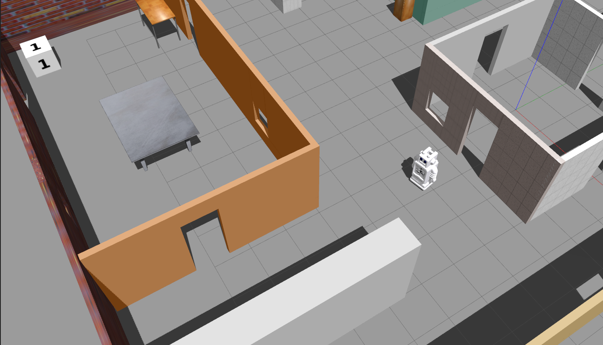
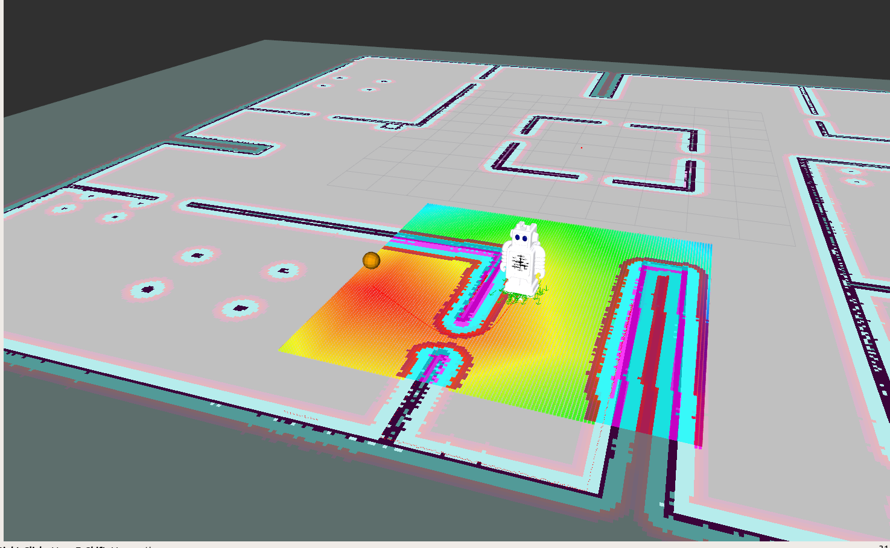
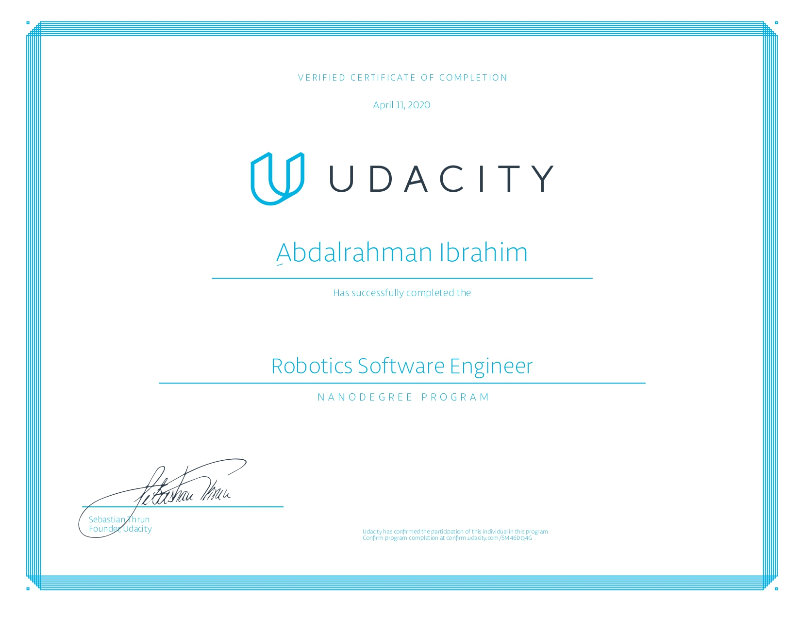

# Robert The Home Service Robot 

## Simulation of service robot capable of SLAM, autonomous navigation and picking and placing virtual objects

This project was built as part of Udacity Robotics Softwere Engineering Nanodegree and its consists of the following projects:

[](https://www.udacity.com/robotics)

* Project1: Build My World
  > Designing a world in Gazebo, where I built myoffice world and the robot Robert.
* Project2: Go Chase It!
  > If a white ball exists in FOV of the Robert bottom camera, he will drive towards it.
* Project3: Where Am I
  > Based on map I generated from myoffice world, robort uses the AMCL localization to localize himself in the world.
* Project4: Map My World
  > Build 2D and 3D accurate map of the environment using RTAB-Map, Robert configured to simultaneous localization and mapping (SLAM)
* Project5: Home Service Robot
  > Combined SLAM and Path Planning and Navigation algorithms into Robert a home service robot that can autonomously transport objects in your home.




## Install and Build Packages

```
$ mkdir -p ~/catkin_ws

#To ensure you download everything, including any submodules:
$ git clone --recursive https://github.com/Geekgineer/Robert-Home-Service-Robot.git .

$ cd ~/catkin_ws/src
$ catkin_init_workspace
$ cd ..
$ catkin_make

$ sudo apt-get update
$ cd ~/catkin_ws/

$ source devel/setup.bash

$ rosdep install --from-paths src --ignore-src -r -y

$ catkin_make
$ source devel/setup.bash

$ sudo apt install xterm

$ cd ~/catkin_ws/src/robert_scripts

```

All the shell scripts use xterm with fixed geometry to launch the simulation and visualization.

### Ball Chaser

```sh
$ ./ball_chaser.sh
```

### Testing SLAM

```sh
$ ./test_slam.sh
```

### Test Navigation

```sh
./test_navigation.sh
```

### Add Markers (Objects)

```sh
./add_marker.sh
```

### Pick Objects

```sh
./pick_objects.sh
```


## Home Service

```sh
./home_service.sh
```

## Results  

[Demo of Pick and Place a ball around the office](https://www.youtube.com/watch?v=b6jFN3bI3RA)

## References

This project utilizes the following ROS packages

[SLAM Gmapping](https://github.com/ros-perception/slam_gmapping)

[Navigation Stack](https://github.com/ros-planning/navigation)

[teleop twist keyboard](https://github.com/ros-teleop/teleop_twist_keyboard)

## Content of RSND


## Certificate

